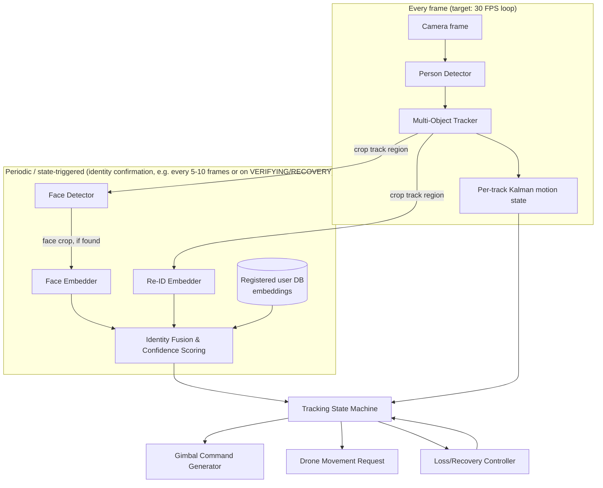

# Architecture & Model Selection

## 1. Why no single model does this job

A beginner-friendly instinct is "find one model that detects and identifies
people." That doesn't exist as a robust production approach, for concrete
reasons:

- **Detectors** (YOLO-family etc.) are trained to answer "is there a person
  here, and where" — they have no concept of *which* person, and retraining
  one per registered user is impractical (needs thousands of images per
  identity, and doesn't scale to registering a new user in the field).
- **Face recognition** answers "whose face is this" but only when a face is
  visible, front-on enough, and large enough in frame. It says nothing when
  the target turns around.
- **Person re-identification (Re-ID)** answers "does this body/appearance
  match a previously seen appearance" using clothing/build/gait cues — works
  when the face doesn't, but is weaker (clothing isn't identity) and is
  *reinforcing* evidence, not standalone proof.
- **Multi-object tracking** answers "which detection in this frame is the
  same physical track as a detection in the last frame" using motion
  continuity — it's what lets us avoid re-running expensive identity checks
  every single frame, but it can still drift onto the wrong person if two
  tracks cross and the tracker's motion model gets confused (this is exactly
  the "identity switch" failure mode your spec calls out).

So the architecture is a **pipeline of specialists coordinated by our own
logic**, not one model:

This mirrors well-established practice: production tracking systems (retail
analytics, sports broadcast tracking, surveillance-adjacent research —
used here strictly in its consent-based form) universally separate detection,
tracking, and re-identification into distinct stages, because each has
different accuracy/speed tradeoffs and failure modes.

## 2. Module breakdown (maps directly to Stage 1 repo layout)

| Module | Responsibility | Depends on |
|---|---|---|
| `video_input` | Abstracts webcam / file / folder / (later) RTSP source into a uniform frame iterator | — |
| `detection` | Wraps the person detector, returns bounding boxes + confidence | `video_input` |
| `tracking` | Wraps the multi-object tracker (ByteTrack), maintains track IDs | `detection` |
| `motion_prediction` | Per-track Kalman filter: velocity/direction/predicted position | `tracking` |
| `face_recognition` | Face detection + embedding extraction + comparison to registered embeddings | `tracking` |
| `reid` | Body-appearance embedding extraction + comparison | `tracking` |
| `identity` | Fuses face + Re-ID + track-continuity signals into one confidence score, decides "this track = target / not / unknown" | `face_recognition`, `reid`, `database` |
| `target_selection` | Manual (Stage 1) or DB-driven (Stage 2+) selection of *which* registered user is the current target | `identity` |
| `recovery` | Implements the loss/search/re-acquire behavior described in the spec | `motion_prediction`, `identity` |
| `state_machine` | The authoritative tracking state machine (§4 below); everything else feeds it, it drives outputs | all of the above |
| `gimbal_control` | Converts pixel error → pan/tilt velocity commands (PID + deadband + limits); Stage 1 = simulated output only | `state_machine` |
| `drone_control` | Converts saturation/loss conditions → high-level movement *requests* with safety gates; no raw motor access, ever | `state_machine` |
| `database` | Local encrypted store for registered users + embeddings + metadata | — |
| `config` | Typed config loading (YAML/env), all thresholds and paths live here | — |
| `logging_utils` | Structured (JSON) logging, one logger per module | — |
| `visualization` | Draws boxes, IDs, state, gimbal vectors on frame for debugging | most modules (read-only) |
| `perf_monitor` | FPS, latency, CPU/GPU/RAM tracking | — |
| `tests` | Unit + integration tests, one test module mirroring each package | all |

Perception (`detection`→`identity`) is fully decoupled from
`gimbal_control`/`drone_control` — they only communicate through the
`state_machine`'s output struct. This is what lets Stage 1 run with a
simulated gimbal and Stage 3 swap in real hardware with zero changes to
perception code (hardware-abstraction requirement from your spec).

## 3. Model comparison and selections

### 3.1 Person detector

| Criterion | YOLOv8n / YOLO11n (Ultralytics) | YOLOX-Nano | NanoDet-Plus |
|---|---|---|---|
| Accuracy (COCO person AP, small model) | Highest of the three | Slightly lower | Lowest, but close |
| Speed (RTX 3090 desktop) | Very high (>500 FPS) | High | Very high (it's tiny) |
| Speed (Jetson Orin Nano / TensorRT INT8) | Excellent, well-documented | Good | Good |
| Model size | ~6 MB (n) | ~7 MB | ~4.5 MB |
| Embedded/quantization support | Excellent — official TensorRT/ONNX/TFLite export tooling | Good — ONNX export, less turnkey | Good, smaller ecosystem |
| Training/fine-tuning ease | Excellent docs, huge community | Good | Harder, smaller community |
| **License** | **AGPL-3.0** (or paid Ultralytics Enterprise license for closed-source use) | **Apache-2.0** | **Apache-2.0** |

**Selection: YOLO11n (Ultralytics), person class only, for Stage 1.**
Rationale: best speed/accuracy ratio, by far the best documentation for a CV
beginner, first-class TensorRT export path for Stage 3 (Jetson) or ONNX path
for Hailo. The AGPL license is a real constraint (R4) — if you later want to
close-source or commercially distribute this project without releasing
source, you'd need Ultralytics' commercial license or we swap to YOLOX-Nano
(Apache-2.0, slightly more integration work, documented as a drop-in
alternative in the detector module's interface). I'm flagging this rather
than deciding it for you because it's a legal/business choice, not a
technical one — let me know your intended distribution model when it matters
(not urgent for Stage 1 personal development use).

### 3.2 Multi-object tracker

| Criterion | ByteTrack | BoT-SORT | DeepSORT |
|---|---|---|---|
| Approach | Motion-only (Kalman + IoU), uses *low-confidence* detections too (fewer missed tracks) | ByteTrack + appearance re-id embedding fused into association | Motion + a separate CNN appearance embedding (older, heavier) |
| ID-switch resistance (crossing paths) | Good, but purely motion-based — can swap IDs when tracks cross closely | Better — appearance embedding helps disambiguate crossings | Historically weaker than ByteTrack/BoT-SORT on modern benchmarks |
| Compute cost | Very low (just Kalman filter + Hungarian matching) | Low-medium (needs an embedding extractor) | Medium |
| Embedded feasibility | Excellent | Good if the embedding model is also embedded-friendly | Fine, but there are strictly better modern options |
| License | MIT | MIT (reference impl) | MIT (most reference impls) |

**Selection: ByteTrack for frame-to-frame tracking, with our own `identity`
module supplying the appearance disambiguation on top** (rather than
BoT-SORT's built-in fusion), because we need face+Re-ID identity confirmation
as a *separate, auditable* step anyway (the spec requires being able to
explain *why* the system believes a track is the target — a black-box fused
tracker makes that harder to reason about and test). ByteTrack gives cheap,
reliable frame-to-frame continuity; our `identity` module is the layer
responsible for "is this specific track still plausibly the registered
target," independent of the tracker's internal matching.

### 3.3 Face detection + embedding

| Criterion | SCRFD + ArcFace (InsightFace) | RetinaFace + ArcFace | MTCNN + FaceNet |
|---|---|---|---|
| Face detection speed (embedded) | Very fast, designed for edge | Slower, heavier | Slowest of the three |
| Embedding accuracy (LFW-class benchmarks) | State-of-the-art tier | State-of-the-art tier (same ArcFace) | Noticeably behind ArcFace-based approaches |
| Model size (lightweight variants available) | Yes — `SCRFD-500MF`/`SCRFD-2.5GF`, `MobileFaceNet` embedder | Yes but larger | Yes, small, but weaker accuracy |
| Quantization/embedded support | Good — ONNX export standard in InsightFace tooling | Good | Good but you're trading accuracy away for little speed gain vs. SCRFD |
| License | Code: MIT (insightface repo). **Pretrained weights vary by model — some are research-only.** Must verify per weight file before use. | Same caveat | Mostly permissive, older/less relevant now |

**Selection: SCRFD (detection) + ArcFace via a lightweight backbone
(MobileFaceNet-class embedding model) from InsightFace.** Action item for
Stage 2: pin exact weight files and record their individual license terms in
`docs/model_licenses.md` before we ship anything — InsightFace bundles some
models trained on datasets with non-commercial research restrictions, and we
will not silently ignore that.

### 3.4 Person re-identification (body appearance)

| Criterion | OSNet (torchreid) | ResNet50-based Re-ID (e.g. Market1501-trained baselines) |
|---|---|---|
| Purpose-built for this | Yes — designed specifically for small, fast, cross-scene re-ID | General backbone repurposed for re-ID |
| Model size | Small (~2–7 MB depending on variant) | Large (~90 MB+) |
| Embedded feasibility | Excellent | Poor without heavy pruning/quantization |
| Accuracy on standard Re-ID benchmarks | Strong for its size class | Higher ceiling, but impractical here |
| License | MIT (torchreid + OSNet) | Varies by implementation, generally permissive |

**Selection: OSNet (small variant, e.g. `osnet_x0_25` or `osnet_x0_5`).**
This is what lets recovery work when the target's face isn't visible
(turned around, partially occluded) — it's explicitly the mitigation for R3.

### 3.5 Motion prediction

Not a learned model — a **Kalman filter** (constant-velocity model) per
track, which is what ByteTrack already uses internally for its own
association, and which we also read out directly to drive the recovery
controller's "predicted direction" behavior. I'll explain the Kalman filter
concept concretely (state vector, predict/update steps) when we implement
`motion_prediction` in Stage 1 — no need to understand it yet.

### 3.6 Licensing summary (to be finalized with exact weight files in Stage 2)

| Component | License | Commercial-use note |
|---|---|---|
| YOLO11n (Ultralytics) | AGPL-3.0 | Needs Ultralytics Enterprise license or AGPL-compliant open release for closed-source distribution |
| ByteTrack | MIT | No restriction |
| SCRFD | Apache-2.0 (code) | Verify specific weight license |
| ArcFace/MobileFaceNet weights | Varies by trained checkpoint | **Must verify before Stage 2 registration feature ships** |
| OSNet (torchreid) | MIT | No restriction |
| OpenCV, NumPy, SciPy, FastAPI/SQLite bindings etc. | BSD/Apache/MIT family | No restriction |

## 4. Tracking state machine

States: `IDLE`, `REGISTERING`, `SEARCHING`, `CANDIDATE_DETECTED`,
`VERIFYING_IDENTITY`, `TRACKING`, `TEMPORARILY_OCCLUDED`, `TARGET_LOST`,
`RECOVERY_SEARCH`, `SAFE_HOVER_REQUESTED`, `STOPPED`, `ERROR`.

| State | Entry condition | Exit condition(s) | Timeout | Control output |
|---|---|---|---|---|
| IDLE | System start / target deselected | Operator selects a registered target | none | No gimbal/drone output |
| REGISTERING | Operator starts registration flow | Registration complete/cancelled | operator-driven | No gimbal/drone output (registration owns the camera) |
| SEARCHING | Target selected, no candidate track yet | A person detected → CANDIDATE_DETECTED | configurable (e.g. 30s) → SAFE_HOVER_REQUESTED | Gimbal may sweep a neutral scan pattern |
| CANDIDATE_DETECTED | Detector+tracker has a track, identity not yet confirmed | Identity confidence ≥ threshold → VERIFYING_IDENTITY; track lost → SEARCHING | few frames | No movement commands (never move toward an unverified candidate) |
| VERIFYING_IDENTITY | Enough face/Re-ID observations queued to fuse a confidence score | Confidence ≥ high threshold → TRACKING; confidence stays low over N observations → SEARCHING (reject candidate) | configurable (e.g. 2s) | No movement commands |
| TRACKING | Identity confirmed, track continuous | Track lost this frame → TEMPORARILY_OCCLUDED; identity confidence decays below threshold → VERIFYING_IDENTITY (re-check) | n/a (steady state) | Full gimbal commands; drone requests if gimbal saturates |
| TEMPORARILY_OCCLUDED | Track lost for <short-occlusion-timeout> | Track reacquired with matching identity → TRACKING; timeout exceeded → TARGET_LOST | configurable (e.g. 1–2s) | Hold last gimbal position / small predictive nudge |
| TARGET_LOST | Occlusion timeout exceeded | Recovery controller engages → RECOVERY_SEARCH | immediate | Save last-known state snapshot |
| RECOVERY_SEARCH | Entered from TARGET_LOST | Candidate re-verified above threshold → VERIFYING_IDENTITY; recovery timeout → SAFE_HOVER_REQUESTED | configurable (e.g. 15–30s) | Gimbal moves toward predicted direction, then bounded search pattern |
| SAFE_HOVER_REQUESTED | Search/recovery/idle timeout exceeded | Operator intervention / target re-selected → IDLE or SEARCHING | n/a | No movement commands; explicit "stop searching" signal upstream |
| STOPPED | Operator/system explicit stop, or unrecoverable input failure (stale camera, DB unavailable) | Operator restart | n/a | All outputs suppressed |
| ERROR | Any module raises an unhandled fault | Operator acknowledgement / process restart | n/a | All outputs suppressed, safety gate forces zero movement |

Every transition, entry, and exit is logged as a structured event
(`state_machine` module) — this doubles as the audit trail for later
debugging identity-switch or false-lock incidents.

## 5. Safety gates (implemented once, enforced everywhere)

`gimbal_control` and `drone_control` never read raw detector/tracker output —
they only ever consume the `state_machine`'s current state + a
`ControlPermission` object that is computed fresh each frame from: identity
confidence, tracking confidence, time-since-last-valid-observation, camera
freshness, and process health. This is a single choke point so "don't move on
low confidence" can't be bypassed by a bug in some other module.
